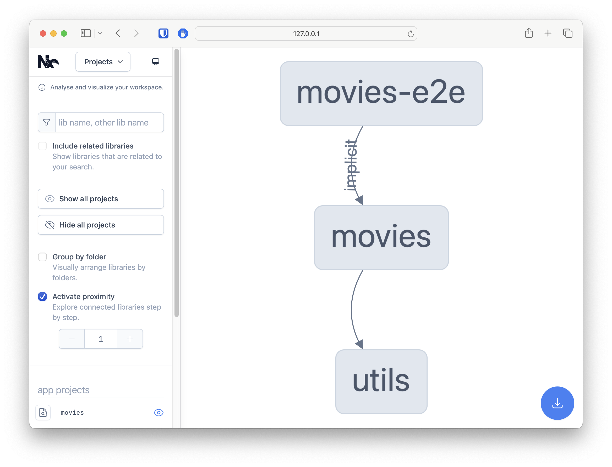
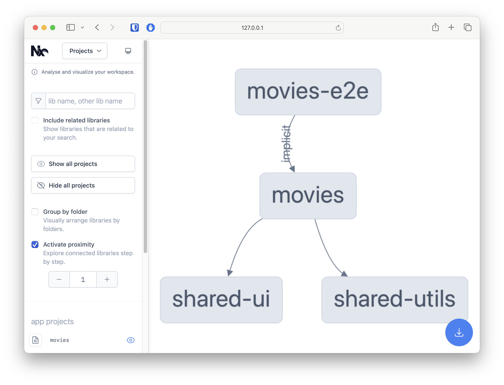

# Nx Workspace Intro Exercises

In this exercise, we will create two new libraries, and move some code around, to get familiar with the Nx workspace structure.

## 1. Create a new shared `utils` library

We want to benefit from the Nx features, so we want to chunk our code into libraries. 

Tasks:
- Create a new library called `utils` in the `libs/shared` directory
- Move the `tilt` directive (`apps/movies/src/app/tilt`) to the newly created library and remove it from the app code
- Export the `tilt` directive from the `utils` library
- Update the import of the `tilt` directive in the `movie-card` component (`apps/movies/src/app/movie-card`)
- Make sure the app still works (run `nx serve movies`)
- Run `nx graph` to see the dependency graph

<details>
  <summary>Solution</summary>

1. Create library

```bash
npx nx generate @nx/angular:library --name=utils --directory=libs/shared --no-interactive
```

> [!TIP]
> Optionally remove the component created by default

2. Copy the tilt directive from the app code to the newly created library 

Drag and drop the files from the app code to the library folder (`libs/shared/utils/src/lib/tilt`), or use the following commands:

```bash
# mac / linux
cp apps/movies/src/app/tilt/tilt.directive.ts libs/shared/utils/src/lib/tilt/tilt.directive.ts
cp apps/movies/src/app/tilt/tilt.directive.spec.ts libs/shared/utils/src/lib/tilt/tilt.directive.spec.ts

# windows
copy apps\movies\src\app\tilt\tilt.directive.ts libs\shared\utils\src\lib\tilt\tilt.directive.ts
copy apps\movies\src\app\tilt\tilt.directive.spec.ts libs\shared\utils\src\lib\tilt\tilt.directive.spec.ts
```

> [!IMPORTANT]
> Delete the files from the app code

3. Export the `tilt` directive from the `utils` library

```ts
// libs/shared/utils/src/index.ts
export * from './lib/tilt/tilt.directive';
```

4. Update the import of the `tilt` directive in the `movie-card` component

```ts
// apps/movies/src/app/movie-card/movie-card.component.ts
import { TiltDirective } from '@ws-nx-enschede-81223/shared/utils';
```

5. Make sure the app still works

```bash
npx nx serve movies
```

6. Run `nx graph` to see the dependency graph

```bash
npx nx graph
```

It should look something like this:

[](./assets/1.project-graph.png)

</details>

## 2. Move the `movie-image.pipe.ts` to the `utils` library

Tasks:
- Move the `movie-image.pipe.ts` to the `utils` library and remove it from the app code
- Export the `MovieImagePipe` from the `utils` library
- Update the import of the `MovieImagePipe` everywhere it is used

<details>
  <summary>Solution</summary>

1. Move the `movie-image.pipe.ts` to the `utils` library and remove it from the app code

Drag and drop the files from the app code to the library folder (`libs/shared/utils/src/lib/movie-image.pipe.ts`), or use the following commands:

```bash
# mac / linux
cp apps/movies/src/app/movie/movie-image.pipe.ts libs/shared/utils/src/lib/movie-image.pipe.ts

# windows
copy apps\movies\src\app\movie\movie-image.pipe.ts libs\shared\utils\src\lib\movie-image.pipe.ts
```

> [!IMPORTANT]
> Delete the files from the app code

2. Export the `MovieImagePipe` from the `utils` library

```ts
// libs/shared/utils/src/index.ts
export * from './lib/movie-image.pipe';
```

3. Update the import of the `MovieImagePipe` everywhere it is used

```ts
// apps/movies/src/app/movie/movie-card.component.ts
// apps/movies/src/app/movie/movie-search-control.component.ts
// apps/movies/src/app/movie/movie-detail-page.component.ts

import { MovieImagePipe } from '@ws-nx-enschede-81223/shared/utils';
```

</details>


## 3. Create a new shared `ui` library

We want to move `backdrop` & `side-drawer` components to a new library, so we can reuse them in other apps.

Tasks:
- Create a new library called `ui` in the `libs/shared` directory
- Move the `backdrop` & `side-drawer` components (`apps/movies/src/app/backdrop` & `apps/movies/src/app/side-drawer`) to the newly created library and remove them from the app code
- Export the `backdrop` & `side-drawer` components from the `ui` library
- Update the import of the `backdrop` & `side-drawer` components in the `app-shell` component (`apps/movies/src/app/app-shell`)
- Make sure the app still works (run `nx serve movies`)
- Run `nx graph` to see the dependency graph

<details>
  <summary>Solution</summary>

1. Create library

```bash
npx nx generate @nx/angular:library --name=ui --directory=libs/shared --no-interactive
```

> [!TIP]
> Optionally remove the component created by default

2. Copy the `backdrop` & `side-drawer` components from the app code to the newly created library

Drag and drop the files from the app code to the library folder (`libs/shared/ui/src/lib/backdrop` & `libs/shared/ui/src/lib/side-drawer`), or use the following commands:

```bash
# mac / linux
mkdir libs/shared/ui/src/lib/backdrop
mkdir libs/shared/ui/src/lib/side-drawer
cp apps/movies/src/app/ui/component/backdrop/* libs/shared/ui/src/lib/backdrop/
cp apps/movies/src/app/ui/component/side-drawer/* libs/shared/ui/src/lib/side-drawer/

# windows
mkdir libs\shared\ui\src\lib\backdrop
mkdir libs\shared\ui\src\lib\side-drawer
copy apps\movies\src\app\ui\component\backdrop\* libs\shared\ui\src\lib\backdrop\
copy apps\movies\src\app\ui\component\side-drawer\* libs\shared\ui\src\lib\side-drawer\
```

> [!IMPORTANT]
> Delete the files from the app code

3. Export the `backdrop` & `side-drawer` components from the `ui` library

```ts
// libs/shared/ui/src/index.ts
export * from './lib/backdrop/backdrop.component';
export * from './lib/side-drawer/side-drawer.component';
```

4. Update the import of the `backdrop` & `side-drawer` components in the `app-shell` component and `side-drawer` component

```ts
// apps/movies/src/app/app-shell/app-shell.component.ts
import { SideDrawerComponent } from '@ws-nx-enschede-81223/shared/ui';

// apps/movies/src/app/side-drawer/side-drawer.component.ts
import { BackdropComponent } from '@ws-nx-enschede-81223/shared/ui';
```

5. Make sure the app still works

```bash
npx nx serve movies
```

6. Run `nx graph` to see the dependency graph

```bash
npx nx graph
```

It should look something like this:

[](./assets/2.project-graph.png)

</details>
